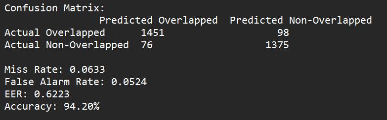
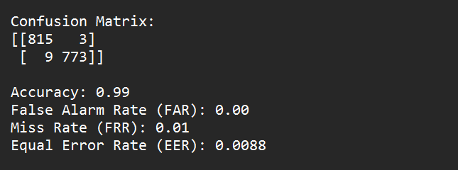

# Overlapped-Speech-Detection
This is machine learning project including deep learning for overlap  speech detection

# Merging Procedure

started the learning with basic knowledge of feature extraction of audio samples using librosa library
and generation of dataset for overlapped and non overlapped using two audio files 

file : merging.ipynb
using this file you can generate the number of samples of overlapped and non overlapped audios.
here we keep the follwing length of generated samples  

min_duration = 2  # Minimum duration in seconds
max_duration = 10 # Maximum duration in seconds  
max duration depends upon the length of smallest file in terms of time,

How It Works :  
Audio 1 : Say X (10 sec length)
Audio 2 : Say Y (20 sec length)

randonly select starting point of both the audios :
for generating overlap samples save audio1 + audio 2
for non overlap save concatenate(audio 1, audio 2)

# Dataset Creation Using Stereo Audio File
here take two stereo audio files and find their dominant channels, and calculate the speech and non speech intervals of the dominant channels of both the files
as the code will save information in a txt file , using those txt files data set will be generated 
Links of Files Used : 
[To be Updated ]
file : streo.ipynb

# Data Set  Generation Using Files From Grid Corpus 
folders = ["s2", "s3", "s12", "s13", "s28", "s29", "s30"]
using these folder dataset is generated for overlapped and non overlapped samples , and speaker information is saved in the txt file , so that it can be used in future  
link to grid corpus : https://zenodo.org/records/3625687  
file : data_generation.ipynb  

Method Of Sample Generation Used Here  (for each sample) : 
1> Randomly select two speakers , then randomly select any audio sample from these two speakers  
2> Then randomly select whether to overlap or not  
3> If Overlap save speaker information of both speakers  and save overlapped audio in dataset 
4> If non overlap then randomly select one speaker out of two and save that audio as non overlap sample in dataset  

# Creating GMM Model using MFCC Features and also using Bays Classifier 
Using The data_generation.ipynb file generated 8000 samples (containing both overlapped and non overlapped samples) using  
folders = ["s10", "s11", "s14", "s15", "s16", "s17", "s18", "s19", "s22", "s23", "s24", "s25", "s26", "s27"]  
and saved its info in a txt file say output.txt (which contains speaker information too)  

File : gmm.ipynb
 
GMM : Gusassian Mixture Model
 
Now using gmm.ipynb follow the follwing steps  
1> parse the metadata of first 5000 samples and save info in overlapped_files and non_overlapped_files in array  
2> Then Make Gusassian Mixture Model for overlapped and non overlapped samples using mfcc features for feature extraction  
3> save gmm model info in txt file and the model too for further use  
4> use last 3000 files for evaluation purpose , and predict the output and save information about ground truth and predicted truth  
5> then save confusion matrix too  

# Deep Learning 

Completed basic knowledge of deep learnig its flow , 
then studied about CNN classfier ( how it works with and without hidden layer )
then implemented the CNN logic to mnist dataset to understand its functionality and libraries like tensorflow

file : mnist_cnn.ipynb

# Convulational Neural Network Model For Overlapped Speech Detection

Once i worked with mfcc features i got following matrix for overlapped speech detection  
  

But i worked with cnn model i got the following matrix results for overlapped speech detection  

#CNN Model for overlapped speech detetction for larger audio files 

In this part we will use a larger audio file , like say 20 mins or 30 mins , and will find the overlapped section in this audio   
How the flow of task will work : 
> We have already saved the model created in the last task , since model size was large so i have provided the drive link for that  
Link : https://drive.google.com/file/d/1G2q_nUBOjLQ-8zTDS3NhgMZLi8n3Ov7A/view?usp=sharing  
Our code Will import this model  and using that we will proceed further 
>To adapt the model you've built so it can handle longer audio files with very small overlaps,  the following steps can be added: 

1. Segment the Long Audio into Smaller Windows: 
Instead of processing the whole 200-second audio file at once, you can break it into smaller segments (e.g., 3-second windows).
Each window can be passed through the model to check for overlap.  
2. Detect Overlap and Capture Timestamps: 
After getting the predictions for each segment, you can check for those with an overlap label ("overlapped").
For each positive overlap prediction, store the start and end timestamps.  
